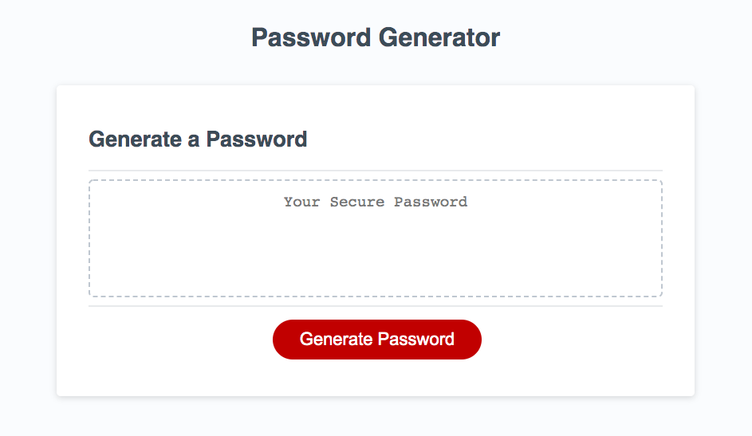

# Random-Password-Generator

## Description

On this project, I refactored a code to randomly generate a password consisting of special characters, numbers, uppercase and lowercase letters. When the user clicks the button 'generate', a password will be created for them consisting of the selected criteria that is presented to them in pop-up form at the top of the screen.

This website was created using HTML, CSS, and Javascript. I think in the future, I would like to implement a 'history' or 'recently generated passwords' section under the button to help with user accessibility. 

[Link to the live site.](https://margaretelson.github.io/Random-Password-Generator/)

[Link to demo video on Youtube.](https://www.youtube.com/watch?v=_8iPlmlJrmo&feature=youtu.be)

## Built With

The following features were used in creating this website:
* HTML
* CSS
* JavaScript
* Git & Git workflow
* GitHub

## Installation

Use VSCode to install.

## License

MIT License

- - - Copyright (c) 2020 Margaret Elson

